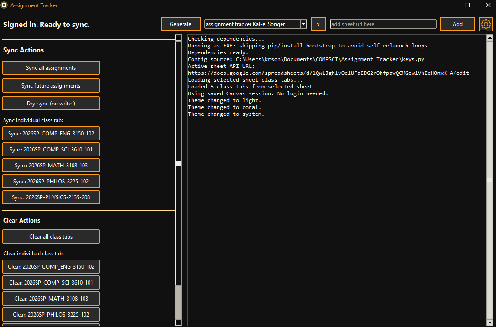
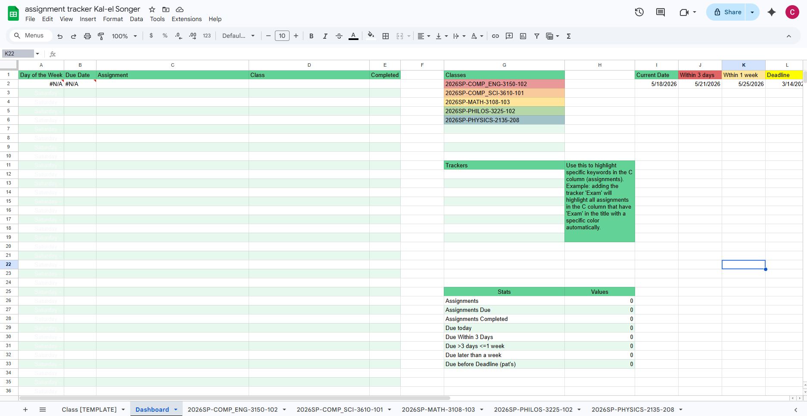
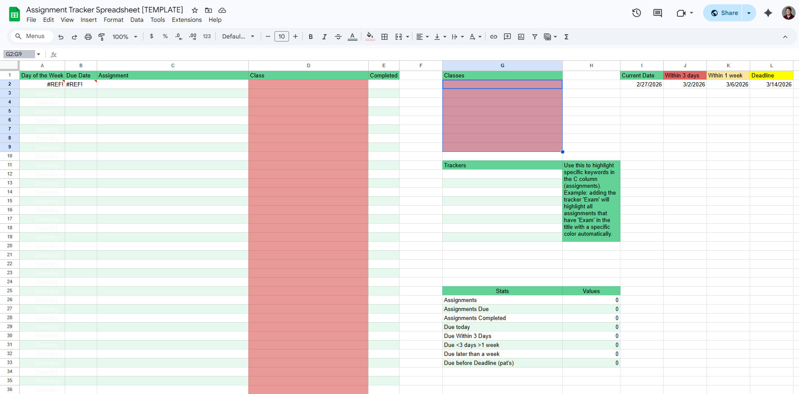
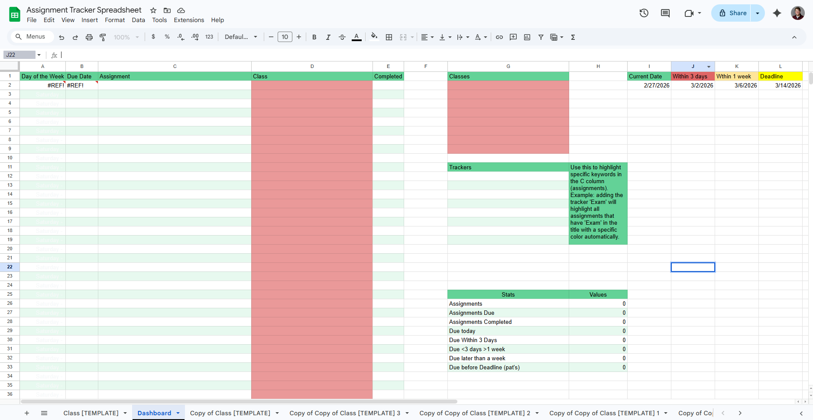
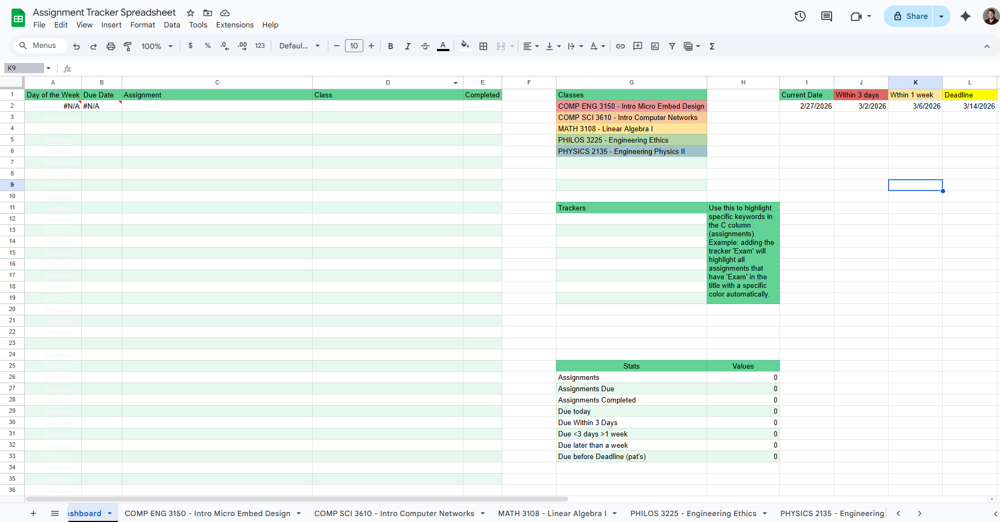
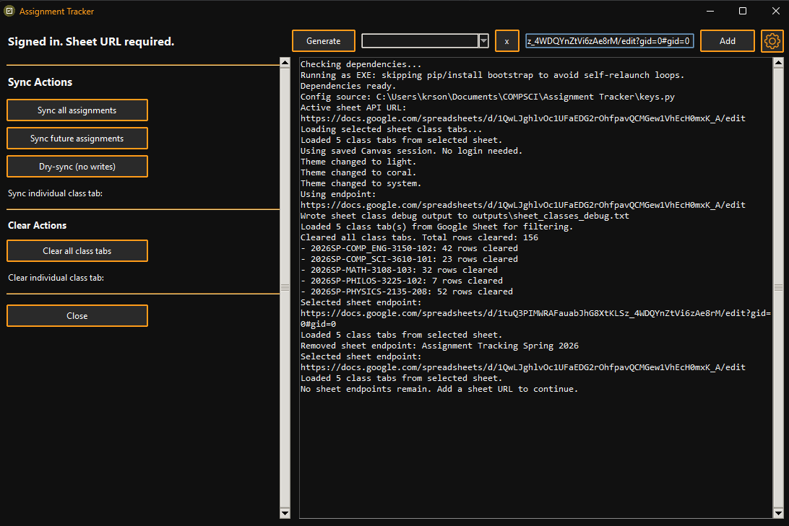
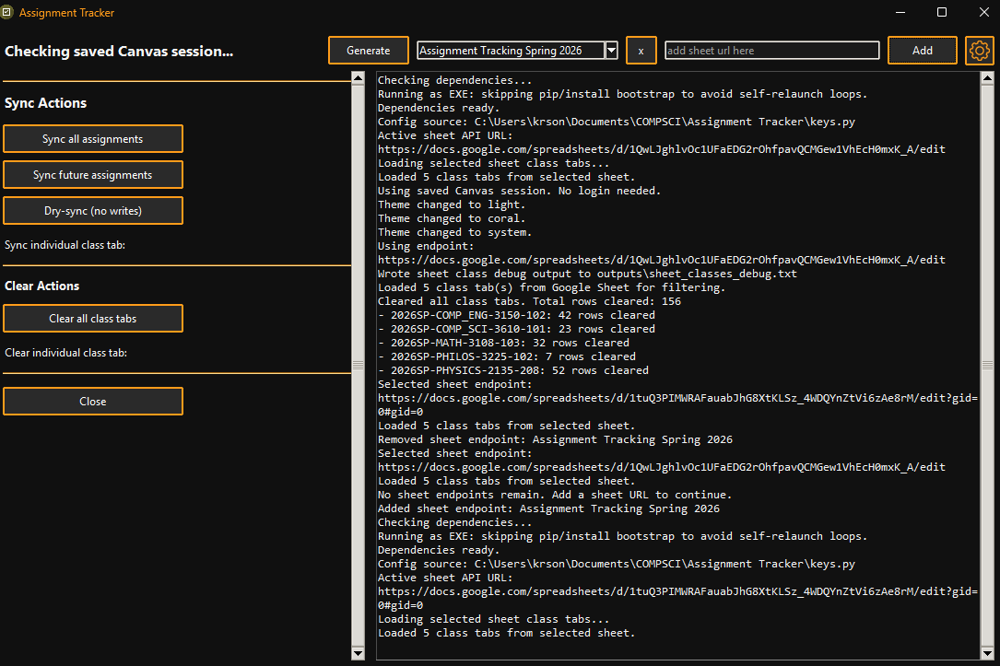
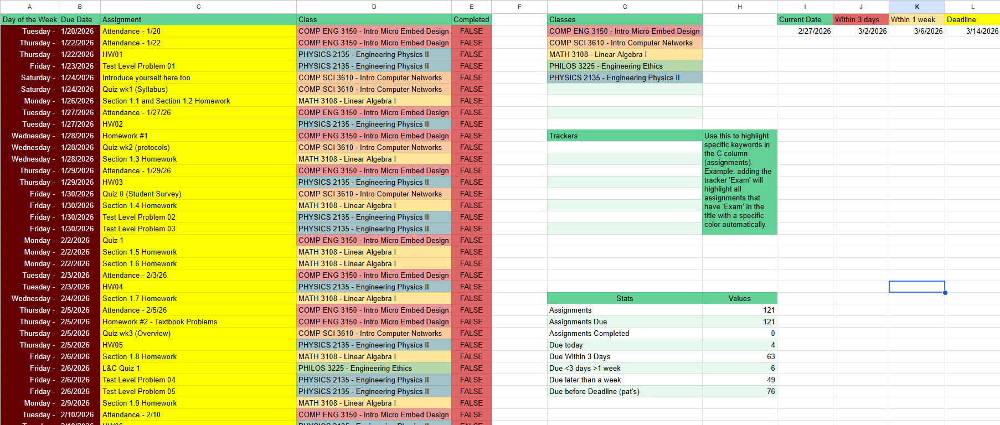
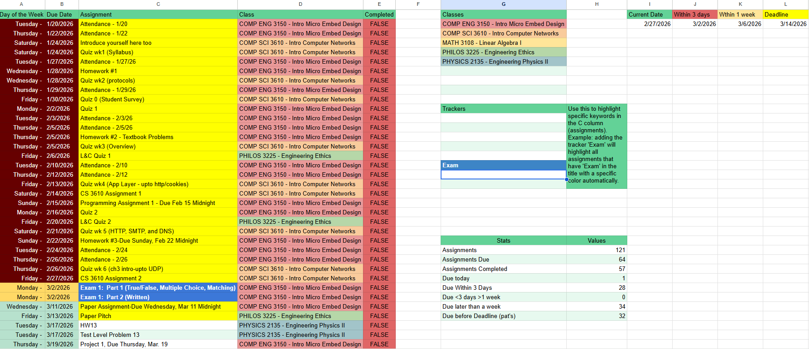

# Assignment Tracker

Assignment Tracker is a desktop app that pulls Canvas assignments and syncs them into a Google Sheet tracker.

## Features

- Canvas sign-in in a browser window with saved local session support.
- Google Sheet support with a saved sheet dropdown.
- Generate a pre-formatted tracker spreadsheet from template.
- Multi-sheet management (add, switch, remove).
- Sync modes:
	- Sync all assignments
	- Sync future assignments
	- Dry-sync (no writes)
- Per-class sync and clear actions.

## Requirements

- Windows
- Canvas account access
- Google account access to the target sheet
- Google OAuth client file (`client_secret.json`)

## Quick Start

1. Open `dist`.
2. Run `AssignmentTrackerGUI.exe`.
3. Complete Canvas sign-in when prompted.
4. Use **Generate** or add an existing sheet URL.

## Setup Option A: Generate a New Tracker (Recommended)

1. Click **Generate** in the top controls.

2. Complete Google auth if prompted.
3. Wait for sheet generation to finish.
4. The new sheet is added to the dropdown and opened in your browser.

## Setup Option B: Use a Manual Copy of the Template

1. Make a copy of the template spreadsheet:
	 https://docs.google.com/spreadsheets/d/17W5u-FZ-bq8ciiSIgSRu7B255P1kheF_G30hGUedHuU/edit?usp=sharing

2. Copy the `class [TEMPLATE]` tab once per class.

3. Rename each copied class tab to exactly match a class listed on Dashboard.

Important: class tab names and Dashboard class names must match exactly.

## Add and Sync

1. Paste your sheet URL into the top field and click **Add**. (Or Generate Spreadsheet)

2. Run one of the sync actions from the left panel.

3. Verify your spreadsheet updates.

## Spreadsheet Color Behavior

- Dark red: due today or overdue.
- Light red: due within 3 days.
- Yellow: due within 1 week.
- Green: due later than 1 week.
- Keyword-based coloring can also be applied from tracker keywords (example: `Exam`).

Checked assignments in class tabs move to the bottom of the Dashboard list.

## Notes

- Default Canvas base URL is `https://umsystem.instructure.com`.
- If your school uses a different Canvas domain, update the Canvas base URL in config.
- Local session/token files are created near the executable/script and reused between launches.
- If Google OAuth shows "app is being tested," your account must be added as a test user in that Google Cloud project.